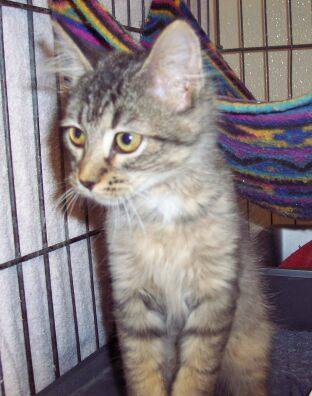
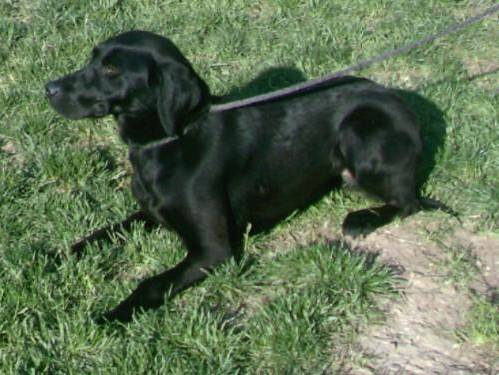
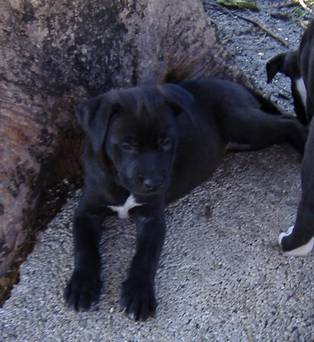
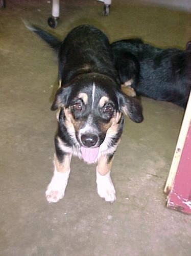
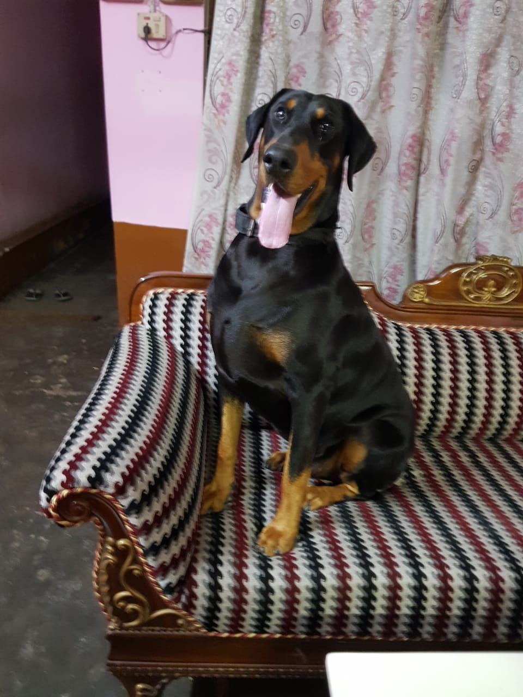

# cat-vs-dog-classification-using-neural-net

So this is nothing fancy and is simply a dog vs cat calssifier. The dataset is basically a KAGGLE dataset of dogs and cat with 25000 total number of images. 

## preprocessing of data
the dataset is not preprocessed and is unlabelled so preparing the dataset is important.
training data can be created by using the create_training_set(size) function which takes in size as the parameter . the size is basically the size of resized image. the path to the dataset is mentioned. The create_label(name) function takes in the name of the image and creates a one hot encoded matrix for the corresponding image. The create_training_set() returns a tuple of X and Y where X is a matrix containing all the images and Y is the one hot encoded matrix containing the labels.
The data is then normalized and further flattened to fed into the neural net.
some of the training images are given below:

## few helper functions
some of the helper function that appears in the code are:

create_batch(dataX,dataY,batch_size) : This functions takes in the dataset of images and their corresponding label and the batch size that  is required for mini batch gradient descent. it returns a list containing a number of tuples. each tuple comtain X and Y where X is batch of images consisiting of batch_size number of entries and Y contains the corresponding labels.

predict_your_image(): this is a function which is used to classify an image given by the user. user needs to define the path of the image and classification is represented on the image.
## The Network
moving forward the network consist of 4 hidden layers  with each containing 1024 number of nodes and a final output layer which consist of two nodes as output. all of them has relu as their activation function.
The images that we feed in has a size of 50*50 so when flattened we have 2500 number of input nodes in the input layer. The optimiser used is Adam optimiser which made sure that the learning rate remains dynamic and the learinng rate is reduced as the cost reduces. The cost function is a softmax cross entropy loss which is similar to cross entropy loss just is for multi class classification.
while training we took 7000 epochs with a learning rate of 1e-4. At the end of training it give a train set accuracy of 99.87% which is not bad keeping in mind the human level error is almost 0% in case of cat vs dogs. The test set also comes from the same distribution has gave a good accurcy of 99.76%.
# testing with real life data
i took few images of dogs and cats near me and i found the following observation.
1. the model is almost sent poercent accurate with the test data
2. it works great with data when the front face of the animal is clearly visible.
3. it struggled when the animal is half covered or is not visible to a greater extend on the frame, or only some portion of the animal is visible on the frame.

Input image 1:

Output image 1:

the reason for the anomaly is understandable after i took a good look at the training data. the training data was devoid of any such data. so an image with such distortion acted as if it came from a separate distribution altogether. so having a development set having such extra features will directly improve the model top tackle such issues.
